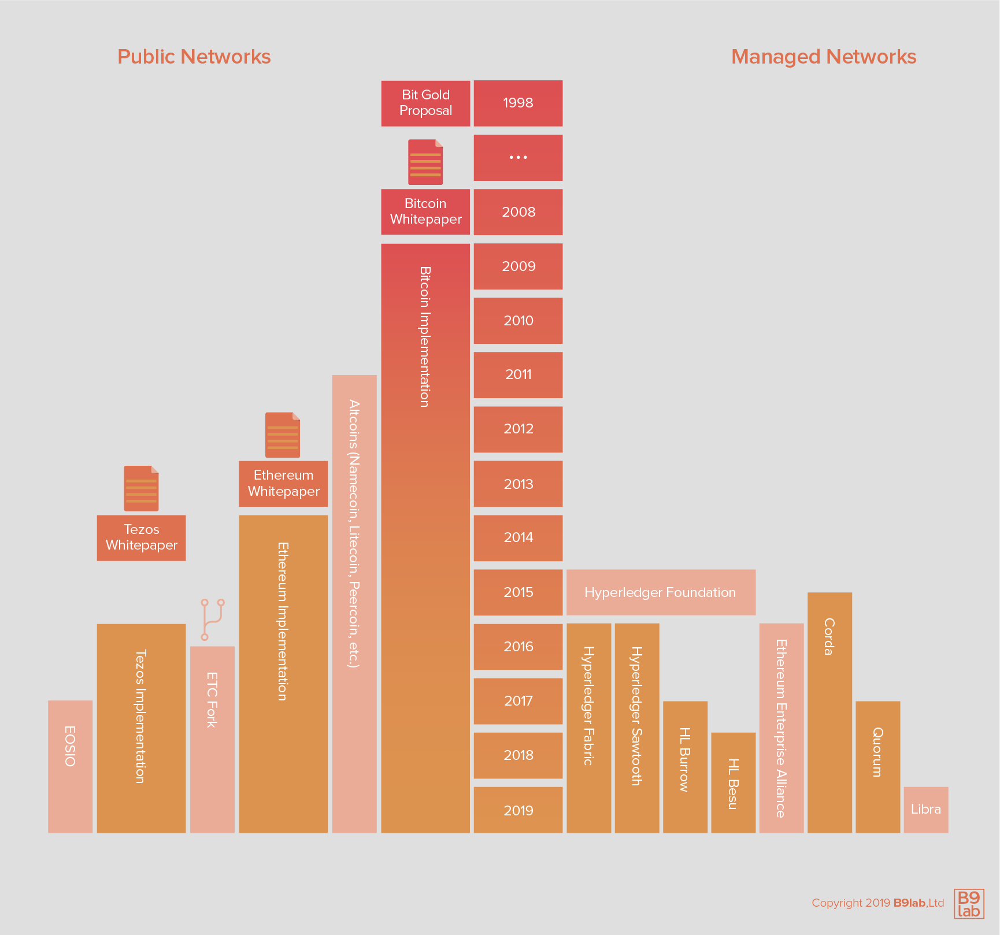
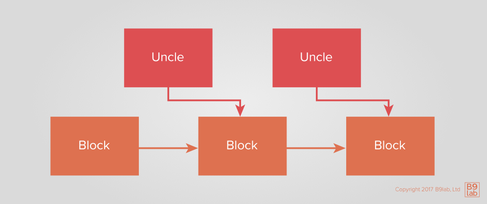

In order to understand whether blockchain technology is a good fit for your project it is important to understand where it comes from and who is driving it.

### 1990s

The first work on the foundations of what becomes blockchain technology much later was undertaken in 1991 by Stuart Haber and W. Scott Stornetta. They first worked on the concept of append-only, cryptographically secured logs. This work was followed by publications in 1996 by Ross J. Anderson and 1998 by [Bruce Schneier](https://www.schneier.com/crypto-gram/) and [John Kelsey](https://www.nist.gov/people/john-m-kelsey). In 1994 computer scientist Nick Szabo first described the concept of [smart contracts](http://www.fon.hum.uva.nl/rob/Courses/InformationInSpeech/CDROM/Literature/LOTwinterschool2006/szabo.best.vwh.net/smart.contracts.html) and in 1998 described BitGold, a conceptual predecessor to Bitcoin.

### 2000s

The first large scale, successful public blockchain network was Bitcoin. The first Bitcoin whitepaper was released on October 31, 2008. It proposed a data structure for the Bitcoin blockchain and laid out the decentralised consensus mechanism.

To this day we do not know who is behind the white paper or the first implementation of the client. The person or group used the pseudonym Satoshi Nakamoto, sparking plenty of conspiracy theories. Several individuals have claimed to be Nakamoto. But to this date none of the claims have been verified.

What is certain is that the community initially working on the network and the client can be characterised as generally pro-capitalism, anti-regulation and monopoly, as well as pro-free-trade. Many of those developing and driving the technology have also heralded its potential to reduce corruption and perceived human failures by pushing processes out of human reach.
All this may not seem important but it is. It means that blockchain as it was built and envisaged initially is not built for banks, governments or incumbent holders of monopolies. This has an influence on the direction of the technology and remains a strong influence on the development of the technology.

Given its censorship resistance blockchain technology has been seized by other groups interested in circumventing government, law enforcement or regulatory control, both on the radical right and left fringes as well as among activists persecuted by their governments.

### 2010s

As soon as it became clear that the technology presents a very attractive base infrastructure for payments, other groups and organisations adapted the technology for their purposes or developed new approaches using the same basic principles but adapting them to more traditional use cases.

In 2014 Vitalik Buterin started what is now known as the second wave of blockchain technology by publishing the paper underlying the Ethereum blockchain protocol, [A Next Generation Smart Contract & Decentralised Application Platform (Vitalik Buterin, Ethereum’s creator)](https://github.com/ethereum/wiki/wiki/White-Paper). Beyond being a distributed ledger, the Ethereum white paper proposed the development of a distributed computation platform.

The Ethereum project raised roughly $20 million in one of the most successful crowdfunds up to that point. The first public network was up and running in 2015. In the same time it spawned the first managed blockchain network approach when the company Eris forked a version of Ethereum and expanded it to implement a layer of permissions, as well as making it easier to deploy custom, access controlled networks.

Late 2015 saw the establishment of the [Hyperledger foundation] (https://www.hyperledger.org/), an industry consortium with a focus on enterprise blockchain technology for managed networks.

Early in 2016, R3CEV, later renamed R3, announced it was working on a distributed ledger "that might otherwise be considered a blockchain, but which the company made perfectly clear was anything but." As we will see, in summary, Corda has many blockchain-like properties as well as distinctive properties.

In 2017 the [Ethereum Enterprise Alliance] (https://entethalliance.org/) was formed as an industry consortium to adapt Ethereum for enterprise use.

Today we can see two broader trends in the development and adoption of blockchain technology.

## Public Blockchains

The most obvious way of operating blockchain protocols comes in the form of a public network. This is what blockchain technology was originally invented for and remains arguably its most powerful use.

A proof-of-work based public blockchain network, such as Bitcoin or Ethereum, has a few specific attributes:

- **Accessibility** - All you need to connect to Bitcoin or Ethereum is the client software and an internet connection. No AML, KYC, identity checks or subscription payment.
- **No hierarchy** - All nodes are equal. No individual node has more authority than another. All miners are equal.
- **Cryptoeconomic incentives** - Because of the lack of central authority there is no absolute defence against malicious behaviour. Instead, the network is usually constructed in a way that incentivises behaviour beneficial to the network and disincentivises behaviour detrimental to the network. Among these incentives are transaction fees, miner rewards and prohibitively expensive costs associated with attacking the network.
- **Full decentralisation** - Most public networks are completely decentralised because they are non-hierarchical and fully accessible. That also means the playing field for market participants is fairly level and traditional business models may not work well in such a setting.

The two most popular examples of functioning public networks are Bitcoin and Ethereum.

### Introduction to Bitcoin

Since 2009 the most successful and popular public blockchain network has been Bitcoin. Bitcoin was first introduced with the publication of the original paper [Bitcoin: A peer-to-peer electronic cash system (2008)](https://bitcoin.org/bitcoin.pdf) by Satoshi Nakamoto. In this paper, Nakamoto describes Bitcoin as a peer-to-peer version of electronic cash. He suggests that proof-of-work can be used to find the truth in a partially synchronous system without involving trusted parties. Using this method, the set of participants controlling the majority of the computing power determines the truth.

Let us look at this in more detail. Nakamoto does not use the term block chain in his paper, but he describes the concept by explaining transactions in Bitcoin. The transaction process requires the signing of the transaction with the hash of the previous transaction and the public key of the recipient. This is called the chain of ownership. Transactions can contain several inputs and outputs.

**Figure 1**: Each block includes the previous hash and a nonce (a random set of `1`s and `0`s). The protocol calls for a hash beginning with a specific number of binary `0`s, when hashing the block. An attacker trying to change a transaction in a block must then mine this and the following blocks. Reproduced from Bitcoin paper.

To prevent double-spending, Bitcoin uses a timestamp server. The miner is looking for a nonce, which results in a block hash beginning with the right number of binary `0`s (See **Figure 1**). It is difficult to find a nonce that fulfils this condition and it is easy to verify that it does. It becomes exponentially more difficult to alter history as more blocks are appended.

In order to promote an alternative version of history, an attacker must find a nonce for the block to change, and for every subsequent block thereafter because the network recognises that the longest valid chain contains the proof of the most work. The longest chain is deemed the truth.

There is a residual probability that a slower attacker can catch up, since getting nonce works by brute force. This possibility decreases exponentially with the number of blocks, a.k.a. confirmations. The protocol includes a reward for mining, which is the first special transaction in the block. It can be expected, that the nodes will use their CPU power honestly to get the reward. Because of the fact that transactions are announced publicly, the public keys of the parties are not private.

### Introduction to Ethereum

Ethereum emerged from a range of proposals rejected by the Bitcoin community. The most important difference, as compared to Bitcoin, is the implementation of distributed code execution through the Ethereum Virtual Machine. This code execution platform is [Turing-complete](https://en.wikipedia.org/wiki/Turing_completeness). The EVM enables the deployment of so-called smart contracts via transactions.

Ethereum has a much faster block time than Bitcoin (currently around 15s), made practical thanks to its implementation of the GHOST protocol.[[1]](http://www.cs.huji.ac.il/~yoni_sompo/pubs/15/inclusive_full.pdf) Ethereum implements a variation of Bitcoin's proof-of-work consensus algorithm called Ethash, which is intended to be ASIC-resistant and GPU friendly[[2]](https://github.com/ethereum/wiki/wiki/Ethash-Design-Rationale). Core developers of the Ethereum project are planning to propose switching to the proof-of-stake consensus algorithm in the future.

Let us have a look at the Ethereum protocol to understand how it differs from Bitcoin. Our reference is the yellow paper [Ethereum: A Secure Decentralised Generalised Transaction Ledger (2014)](http://gavwood.com/paper.pdf) by Dr. Gavin Wood.

The Ethereum network is a virtual state machine, the Ethereum Virtual Machine (EVM). The implementation of such a state machine with blockchain is revolutionary in itself. To achieve Turing-completeness frameworks must overcome the "halting problem" which is difficult, especially in a distributed, hierarchy-free computing platform. In case this is not clear, the halting problem is about what to do in the case that a process runs amok. Well-known solutions such as a hardware reset do not apply to a worldwide state machine that cannot be restarted.

Ethereum’s solution is to introduce “gas” as a fee for each computational step. Every block has a maximum gas limit. This limits the number of computational steps that can be executed per block. When paid for, gas is given a price.  Individual users control this price at the transaction level, and are free to specify any gas price. That is, users bid for network computation. When the accounting is done, the EVM converts this transaction gas price and gas consumed into Ether spent. Ether is the native Ethereum currency, which is issued via the mining process. The Ethereum protocol defines the gas cost for each operation in the EVM.

A smart contract in the EVM is practically an autonomous agent with an internal account. While external actors, e.g. human, sign transactions, smart contracts execute deterministic code. *Smart contracts have no alternative.* Correct execution of smart contract code is part of the transaction validation process. The most popular high-level language for writing smart contracts for Ethereum is Solidity.

**Figure 2**: A well-understood challenge related to reduced block time stems from network latency. Since nodes do not know about discovered blocks at the same time, at any given time a portion of the miners will be working on already solved, i.e. old, blocks. If these miners find a solution, they might not be rewarded. The rate at which such transient "forks" occur increases predictably with shorter block times. While Bitcoin addresses this efficiency issue with a relatively long block time (ten minutes), Ethereum addresses this concern with a partial reward strategy. Valid blocks that are not ultimately included in the prevailing chain are still included on the side and known as "uncles". Miners of uncles receive a smaller reward than regular block miners.

The precise mechanism employed by Ethereum is called GHOST. GHOST includes so-called uncles that are propagated into the network, too late to rise to the level of network consensus (see Figure 2). This increases the total difficulty of the chain, makes smaller block times (about 14-18 seconds) possible and rewards miners of uncles for contributing to the overall strength of the network.

<!-- How Does Blockchain Actually Work? https://www.youtube.com/embed/Za5lPKNV_Mk -->
