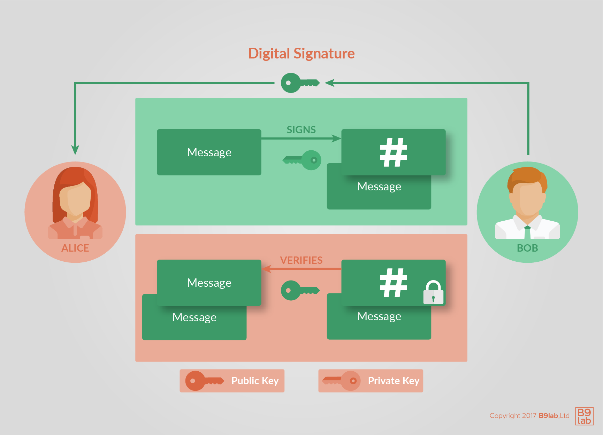
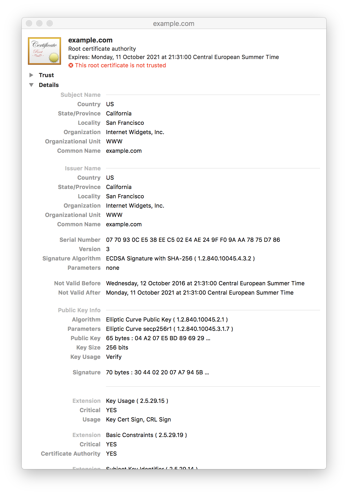

### Public key cryptosystems

Modern cryptographic systems leverage computer capabilities to make accessible the power of certain mathematical functions.

#### Public / private key

Such keys always come in pairs and offer various capabilities. Those capabilities are based on cryptographic mathematics. As their name suggest, the public key is meant to be distributed to whoever is relevant, while the private key is to be jealously guarded, akin to having your house address public, but keeping the key to your house private.

Let's have a look at examples, which you may know under the names:

* RSA
* PGP, GnuPG

Example (Linux):

```
// Create SECP256K1 private key with explicit parameters for backward compatibility
$ openssl ecparam -name secp256k1 -genkey -noout -out secp256k1-key.pem -param_enc explicit
// Create public key
$ openssl ec -in secp256k1-key.pem -pubout -out secp256k1-key-pub.pem
// Show public key
$ openssl ec -in secp256k1-key-pub.pem -pubin -text -noout

// Create RSA private key
$ openssl genrsa -des3 -out rsa-key.pem 2048
Generating RSA private key, 2048 bit long modulus
.....................................................+++
...........+++
e is 65537 (0x10001)
Enter pass phrase for rsa-key.pem:
Verifying - Enter pass phrase for rsa-key.pem:
// Create public key
$ openssl rsa -in rsa-key.pem -outform PEM -pubout -out rsa-key-pub.pem
Enter pass phrase for rsa-key.pem:
writing RSA key
```

This is like a password that is used to encrypt your private key on disk. If the private key was not encrypted, it would be at greater risk of theft. Since you are just testing here, you can put nothing or a simple word. But remember that whenever you create keys in the future, you need to protect them with a proper password.

Note that you may need openssl version 1.0 or newer.

#### Encrypt and decrypt

Alice wants to send a message to Bob, and for Bob's eyes only:

* Bob gives Alice his public key
* Alice uses Bob's public key to encrypt the message
* Alice sends Bob the encrypted message
* Bob decrypts the message with his private key


Example:

```bash
// Encrypt file
$ openssl pkeyutl -encrypt -pubin -inkey rsa-key-pub.pem -in helloworld.txt -out helloworld.enc
// Decrypt file
$ openssl pkeyutl -decrypt -inkey rsa-key.pem -in helloworld.enc -out helloworld2.txt
```

If you receive an error, try with `openssl rsautl` instead.

#### Sign and verify

Alice wants to make sure that Bob's public announcement is indeed from Bob:

* Bob gives Alice his public key
* Bob signs his announcement with his private key
* Bob sends Alice his announcement and its signature
* Alice verifies the signature with Bob's public key



Example:

```bash
// Sign file hash
$ openssl dgst -sha256 -sign secp256k1-key.pem -out helloworld-bin.sha256 helloworld.txt
// Encode signature in Base64
$ openssl base64 -in helloworld-bin.sha256 -out helloworld.sha256

// Decode signature form Base64
$ openssl base64 -d -in helloworld.sha256 -out helloworld-bin-decoded.sha256
// Verify signature
$ openssl dgst -sha256 -verify secp256k1-key-pub.pem -signature helloworld-bin-decoded.sha256 helloworld.txt
Verified OK
```

#### Mix and match

It is possible to mix both ideas, whereby Alice encrypts her message with Bob's public key, then signs the encrypt file with her private key. Upon reception, Bob verifies the signature with Alice's public key, then decrypts the file with his private key.


### Key management, PKI

If you look again at the Alice and Bob examples, you will notice that there is a vulnerability in "Bob gives Alice his public key". A malicious Charlie could intercept Bob's public key and pass on his own public key to Alice.
Key management and public key infrastructure (PKI) is an important aspect of cryptography that helps mitigate this risk.

### Theory

#### RSA

RSA(Rives, Shamir, Adleman) is a public-key cryptosystem that was first published in 1977.

The premise is that if you have a public key ```$$(pubKey,n)$$``` and a private key ```$$priKey$$``` then you can:

* encrypt a message with the following:

`$$message ^{pubKey} \equiv encMessage \mod n$$`

* decrypt the encrypted message with the following:

`$$encMessage ^{priKey} \equiv  message \mod n$$`

Or that in fact there exist `$(priKey,pubKey,n)$` such that `$(message ^{pubKey}) ^ {priKey} \equiv message \mod n$`, with the additional hurdle that calculating `$priKey$` out of `$(pubKey,n)$` is computationally expensive and in practice impossible.

Let's work this in detail.

#### How

How to calculate a `$(pubKey,n)$` and a `$priKey$` ?

* First we have to choose two prime numbers `$p$` and `$q$`. Then we can calculate `$n(p,q)=p \cdot q$`.
* After that, we calculate Euler's totient function

`$$\phi(n(p,q))= (p-1)\cdot(q-1)$$` only if p and q are prime numbers. Otherwise, it is a NP problem.

* Now we can use a random `$pubKey$`, which is not a divisor of `$\phi(n)$` and is smaller than `$\phi(n)$`.

Calculating `$priKey$` means calculating `$b$` in following equation:

`$$a \cdot \phi(n)+b \cdot pubKey=1$$`

Where we can use the extended euclidean algorithm. Now we can delete `$p,q$` and `$\phi(n)$`.

#### Example

Let's have a look on an example.

* We use `$p=2399$` and `$q=26371$`, which are prime numbers.
Then we have `$n=63264029$` and `$\phi(n)= 63235260$`.
* Now, we have to set a `$pubKey< \phi(n)$`. So we use `$pubKey=54833$`.
* That gives us with extended euclid a `$priKey=6589577$`

Now we delete `$p,q$` and `$\phi(n)$`. If we want to encrypt the `$message=9874587$` we get:

`$$9874587^{54833} \equiv 36898107 \mod 63264029 $$`

If you have the `$priKey$`, then you can calculate the message:
`$$36898107^{6589577} \equiv 9874587 \mod 63264029$$`

#### Why it works

There is a proof with Fermat's little theorem, that `$$(message ^ {pubKey}) ^ {priKey} \equiv message \mod n$$` is true.

`$a \cdot \phi(n)+ priKey \cdot pubKey=1$` means:

`$$priKey \cdot pubKey\equiv 1 \mod \phi(n)$$`

And because `$\phi(n)=(p-1)(q-1)$`
It follows `$$priKey \cdot pubKey-1=h(p-1)=k(q-1)$$`

And then:

`$$(message^{pubKey})^{priKey} $$`

`$$=message^{pubKey \cdot priKey} $$`

`$$=message \cdot message^{pubKey \cdot priKey-1} $$`

`$$=message \cdot message^{h(p-1)} $$`

`$$=message \cdot (message^{p-1})^{h} $$`

Fermat's little theorem is: `$$message^{p-1}\equiv 1 \mod p$$` if `$p$` does not divide `$message$`.  If `$message \equiv 0 \mod p$` then `$$message^{pq} \equiv message \mod p$$`
Otherwise:

`$message \cdot (message^{p-1})^{h} \equiv message \cdot 1^{h} \equiv message \mod p$`

If we do the same steps for `$q$`, we show, `$$(message ^ {pubKey}) ^ {priKey} \equiv message \mod {p \cdot q}$$` This is, why RSA works.

#### Trivial zero knowledge Proof

RSA fits  `$E(x) \cdot E(y)=x^e \cdot y^e=e^{xy}=E(xy)$`
That means we can prove, if `$x \cdot y$` calculated well, without knowing x or y.

In our example, if we use `$x=12$` and `$y=24$`, then we get `$12 \cdot 24=288$`  for the output and we get `$$E(12) \cdot E(24) \equiv E(288) \equiv 60822364  \mod 63264029 $$` with same `$(pubKey,n)$` and `$priKey$` like in the above section. So if we give someone `$E(12)$`, `$E(24)$` and our output `$288$`, he can verify, if the calculation is done well, without knowing `$x$` and `$y$`.

Another trivial example are digital Signatures with RSA. They are zero-knowledge proofs, because, you are proving, that you have a private key, which is the pair to the public key, without giving any information about your private key.


#### Cryptographic hash functions

Such a hash function:

* converts an input, a.k.a. the message, into an output, a.k.a the hash
* does the conversion in a reasonable amount of time
* is such that it is practically impossible to re-generate the message out of the hash
* is such that the tiniest change in the message, changes the hash beyond recognition
* is such that it is practically impossible to find 2 different messages with the same hash

With such a function, you can:

*  prove that you have a message without disclosing the content of the message, for instance:
    * to prove you know your password
    * to prove you previously wrote a message
* rest assured the message was not altered
* index your messages

MD5 is such a function:

```bash
$ echo "The quick brown fox jumps over the lazy dog" | md5
37c4b87edffc5d198ff5a185cee7ee09
```

On Linux, it is `md5sum`. Now let's introduce a typo:

```bash
$ echo "The quick brown fox jump over the lazy dog" | md5
4ba496f4eec6ca17253cf8b7129e43be
```

Notice how the 2 hashes have nothing in common.

`MD5` is no longer considered a hard-to-crack hash function. Bitcoin uses `SHA-256`. Ethereum uses `Keccak-256`and `Keccak-512`.

It is possible to index content by its hash, in essence creating a hashtable. If you have used IPFS or BitTorrent's magnet links, among others, then you have used a hashtable.

### Digital Certificates

Digital certificates are used (among other things) to prove an identity. They are given by a recognised Certification Authority(CA). A widespread procedure is the public key certificate. It proves the ownership of a public key. Below, we describe the X.509 standard.

The X.509 standard is defined by the Telecommunication Standardization Sector (ITU-T) of the International Telecommunication Union (ITU).[[1]](https://en.wikipedia.org/wiki/X.509) It offers format and semantics for public key certificates. [X.509](https://www.ietf.org/rfc/rfc5280.txt) is profiled in the formal language ASN.1. Common use cases are validation of documents and securing of communication. For an example, X.509 is used in TLS/SSL. Its origin is in the X.500 standard issued in 1988. Since version 3, X.509 enables flexible topologies, like bridges and meshes. Invalid certificates are listed in certificate revocation lists (CRLs). CRL is vulnerable against DoS attacks.

A X.509 certificate contains information such as version number, serial number, signature algorithm, validity period, subject name, public key algorithm, subject public key, certificate signature algorithm, certificate signature and extensions. An extension has a type, a corresponding value and a critical flag. Non-critical extensions are only informational.


#### Signature

The concept of digital signatures is simple. If a given message is first hashed and then encrypted by a private key, one can verify the signature by decryption with corresponding public key. We need to hash the message to avoid the creation of signatures by mixing the messages and corresponding signatures. (See RSA chapter) This way, we know, that the sender has the private key to the given public key. However, this is not truly an identification. Here comes the CA. The CA signs a certificate to prove the identity of the owner of a public key. The certificate includes, as described above, the subject name. This must be verified by the CA. So, the identity is given, if one can verify the CA’s signature and trust the CA.

Here is a Hyperledger Fabric example certificate:


### Learn More

- [Zero-knowledge proof](https://en.wikipedia.org/wiki/Zero-knowledge_proof)
- [EC Operations](https://wiki.openssl.org/index.php/Command_Line_Elliptic_Curve_Operations)
- [Encrypt and Decrypt](http://osxdaily.com/2012/01/30/encrypt-and-decrypt-files-with-openssl/)
- [Sign and verify](https://gist.github.com/ezimuel/3cb601853db6ebc4ee49)
